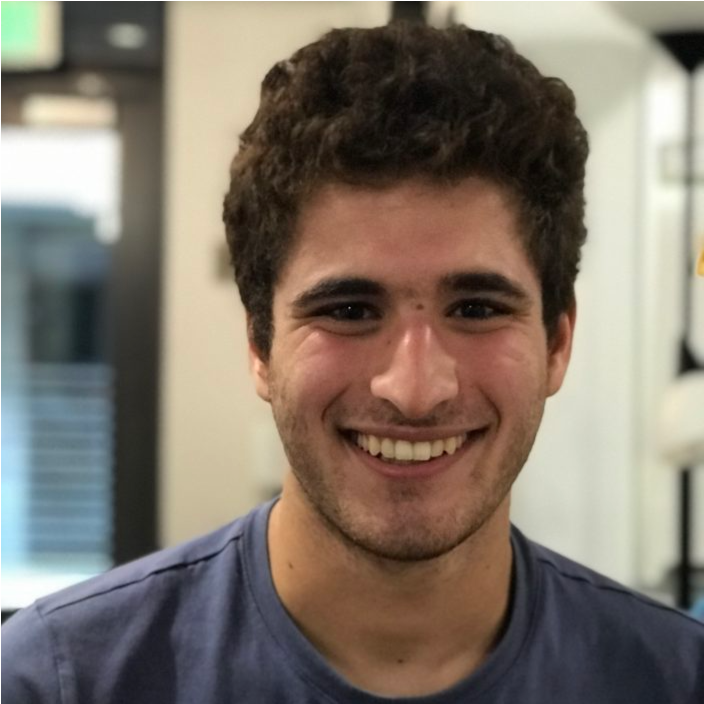
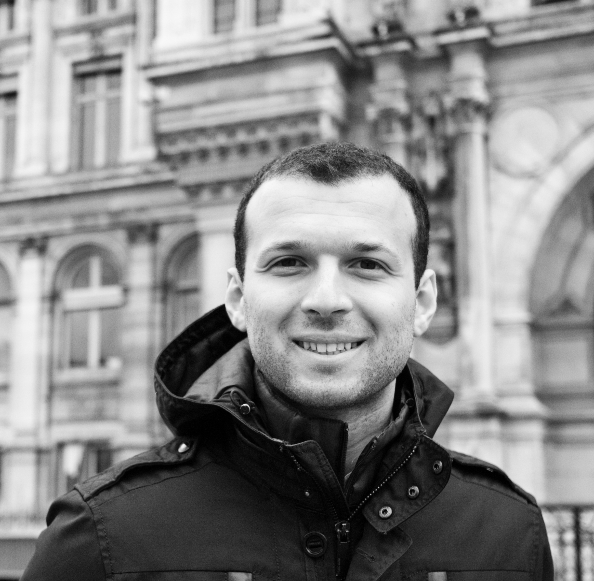

## Overview
It is an exciting time in the world of quantum computing, as we continue to make rapid progress towards practical quantum computation. To realize the full potential of the devices we have today and on the horizon, we need optimizing compilers that convert abstract descriptions of quantum circuits to native device operations. 
However, quantum architecture design remains in flux, with multiple competing hardware substrates and error-correction protocols. In this tutorial, we will describe the key challenges in quantum circuit optimization and introduce our efforts at the University of Wisconsin–Madison towards a flexible 
and performant compiler for the shifting hardware landscape.

No prior background in quantum computing is necessary! After participating in the tutorial, attendees will be able to  

-  Define the fundamental units of quantum computation—qubits, gates, and circuits—and give a few examples of quantum algorithms
-  Describe the landscape of approaches for *quantum-circuit optimization*, the problem of expressing a quantum circuit in as few native gates as possible
-  Explain *qubit mapping and routing*, the stage in which a compiler must lay out a circuit onto a device in a way that respects connectivity constraints
-  Use our compiler, ``wisq``, to apply the quantum-circuit optimization and qubit mapping and routing compiler passes

When: **Sunday October 12th, 9:00-10:30 SST and 11:00-12:30 SST**

Where: **Seminar Room 6** @ NUS School of Computing (COM1 Level 2, 13, Computing Dr, Singapore, 117417)

## Schedule 
We will be presenting the same 90-min tutorial in both time slots.

|     |     |  |
| --- | --- | --|
| 9:00-9:15 and 11:00-11:15 | Quantum Computing Fundamentals   | [Slides](files/splash25-background-slides.pdf) |
| 9:15-9:45 and 11:15-11:45 | Quantum-Circuit Optimization     | [Slides](files/splash25-circuit-opt-slides.pdf) |
| 9:45-10:15 and 11:45-12:15 | Qubit Mapping and Routing        | [Slides](files/splash25-qmr-slides.pdf) |
| 10:15-10:30 and 12:15-12:30 | A Practical Tour of our Compiler | |

## Resources
Here are some supplementary resources on the material we cover in the tutorial.

[Qubit Mapping and Routing via MaxSAT](files/micro22.pdf).
In this MICRO '22 paper, we develop an algorithm for the qubit mapping and routing problem for near-term devices without error-correction.
Our approach uses a reduction to MaxSAT and a "circuit slicing" technique to find better solutions than existing heuristic-based approaches while scaling better than existing constraint-based approaches.

[Dependency-Aware Compilation for Quantum Surface Code Architectures](files/oopsla25.pdf).
In this OOPSLA '25 paper, we turn to the qubit mapping and routing problem for fault-tolerant quantum devices. 
We solve this problem by exploiting the dependency structure of circuit operations to formulate discrete optimization problems that can be approximated via simulated annealing.

[Generating Compilers for Qubit Mapping and Routing](files/popl26.pdf).

[Synthesizing Quantum-Circuit Optimizers](files/pldi23.pdf).
In this PLDI '23 paper, we introduce a technique for synthesizing a quantum-circuit optimizer given an arbitrary gate set for some device. Our approach uses a novel data structure to efficiently synthesize pairs of equivalent circuits, which can be used to rewrite circuits. For example, in 1.2 minutes, we can synthesize an optimizer targeting the IBM gate set that significantly outperforms leading hand-crafted optimizers.

[Optimizing Quantum Circuits, Fast and Slow](files/asplos25.pdf).
In this ASPLOS '25 paper, we unify two disparate techniques for optimizing quantum circuits — rewrite rules, which are fast standard optimizer passes, and unitary synthesis, which is slow, requiring a search through the space of circuits. We then introduce a radically simple, yet extremely effective, algorithm for scheduling these optimizations.

[The ``wisq`` compiler](https://github.com/qqq-wisc/wisq). Our open-source compiler implements our algorithms and provide a unified interface for both passes.

## Organizers

 <a href=https://pages.cs.wisc.edu/~amolavi> Abtin Molavi</a>
 

 
 <a href=https://amandashoe.github.io>Amanda Xu</a> 
 

 
 <a href=https://swamittannu.com>Swamit Tannu</a> 
 

  
 <a href=https://pages.cs.wisc.edu/~aws>Aws Albarghouthi</a> 
 

